<
- [High-Level Data Flow](#high-level-data-flow)
- [Module Dependency Graph](#module-dependency-graph)
- [Component Breakdown](#component-breakdown)
  - [Data Models (models.py)](#1-data-models--modelspy)
  - [Scenario I/O (scenario_io.py)](#2-scenario-io--scenario_iopy)
  - [Formatting Utilities (formatting.py)](#3-formatting-utilities--formattingpy)
  - [Objective Rules (rules.py)](#4-objective-rules--rulespy)
  - [Scheduling Engine (scheduler.py)](#5-scheduling-engine--schedulerpy)
  - [Streamlit Dashboard (app.py)](#6-streamlit-dashboard--apppy)
- [Scheduling Algorithm Deep-Dive](#scheduling-algorithm-deep-dive)
- [Data Structure — Scenario JSON](#data-structure--scenario-json)
- [Data Model Relationships](#data-model-relationships)
- [Scoring System Internals](#scoring-system-internals)
- [Hard-Rule Validation](#hard-rule-validation)
- [Extensibility Design](#extensibility-design)
- [Data-Only Changes Matrix](#data-only-changes-matrix)
- [Design Decisions & Tradeoffs](#design-decisions--tradeoffs)
- [Assumptions](#assumptions)

---

## System Overview

The Bus Charging Scheduler is a **constraint-aware search engine** that assigns electric buses to shared en-route charging stations. It uses a modular pipeline architecture with clean separation between:

- **Feasibility** — hard constraints that must never be violated
- **Optimality** — soft scoring rules with configurable weights
- **Presentation** — an interactive dashboard decoupled from the engine

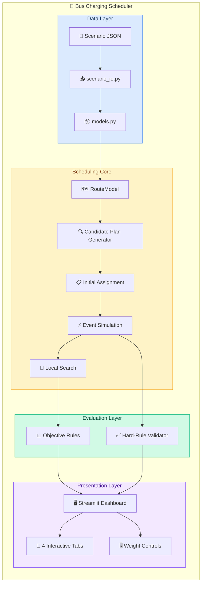

---

## High-Level Data Flow

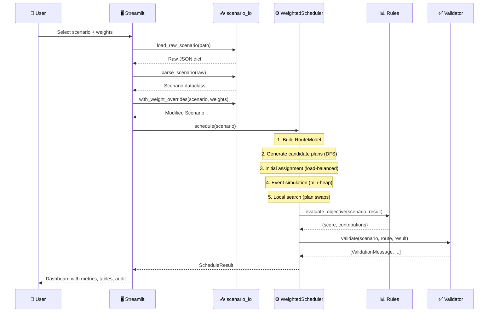

---

## Module Dependency Graph

Every import relationship in the codebase:

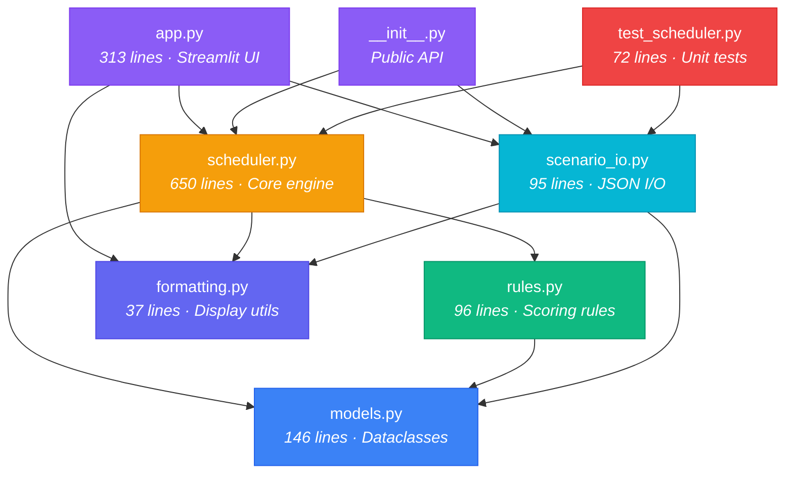

---

## Component Breakdown

### 1. Data Models — `models.py`

**Purpose:** Immutable dataclasses that represent every entity in the system. Frozen where possible to prevent accidental mutation during scheduling.

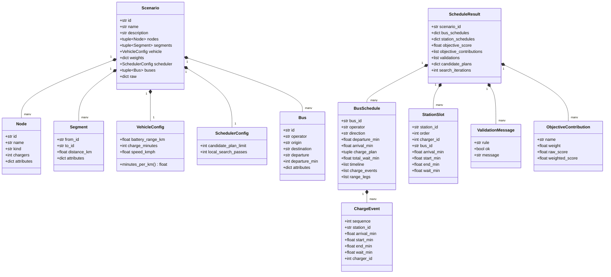

**Key design choices:**
- `Scenario`, `Node`, `Segment`, `Bus`, `VehicleConfig` are **frozen** — immutable after creation
- Every model carries an `attributes` dict for **forward-compatible** extension (e.g. `priority`, tariff bands)
- `Scenario.raw` preserves the original JSON for rules that need raw data access

---

### 2. Scenario I/O — `scenario_io.py`

**Purpose:** Parse JSON files into typed `Scenario` objects. Handles clock parsing, unknown-field preservation, and weight overrides.

| Function | Description |
|---|---|
| `load_raw_scenario(path)` | Read JSON file → raw dict |
| `parse_scenario(raw)` | Raw dict → `Scenario` dataclass |
| `load_scenario(path)` | Combined load + parse |
| `load_scenarios(directory)` | Glob `*.json` in folder → list of `(Path, Scenario)` |
| `with_weight_overrides(scenario, weights)` | Return new `Scenario` with replaced weights (immutable) |
| `scenario_names(scenarios)` | Build `{name: path}` lookup |

**Field handling:** Known fields (`NODE_FIELDS`, `SEGMENT_FIELDS`, `BUS_FIELDS`) are mapped to typed dataclass fields. Everything else flows into `attributes` — this means you can add `"priority": "high"` to a bus and a custom rule can read it without touching the parser.

---

### 3. Formatting Utilities — `formatting.py`

**Purpose:** Human-readable time display for the dashboard.

| Function | Input | Output |
|---|---|---|
| `parse_clock("19:45")` | `"HH:MM"` string | `1185` (minutes since midnight) |
| `format_clock(1185)` | Minutes float | `"19:45"` |
| `format_clock(1855)` | Minutes > 24h | `"06:55 (+1d)"` |
| `format_duration(53)` | Minutes | `"53m"` |
| `format_duration(125)` | Minutes | `"2h 5m"` |

---

### 4. Objective Rules — `rules.py`

**Purpose:** Pluggable scoring rules that define the multi-objective optimization landscape.

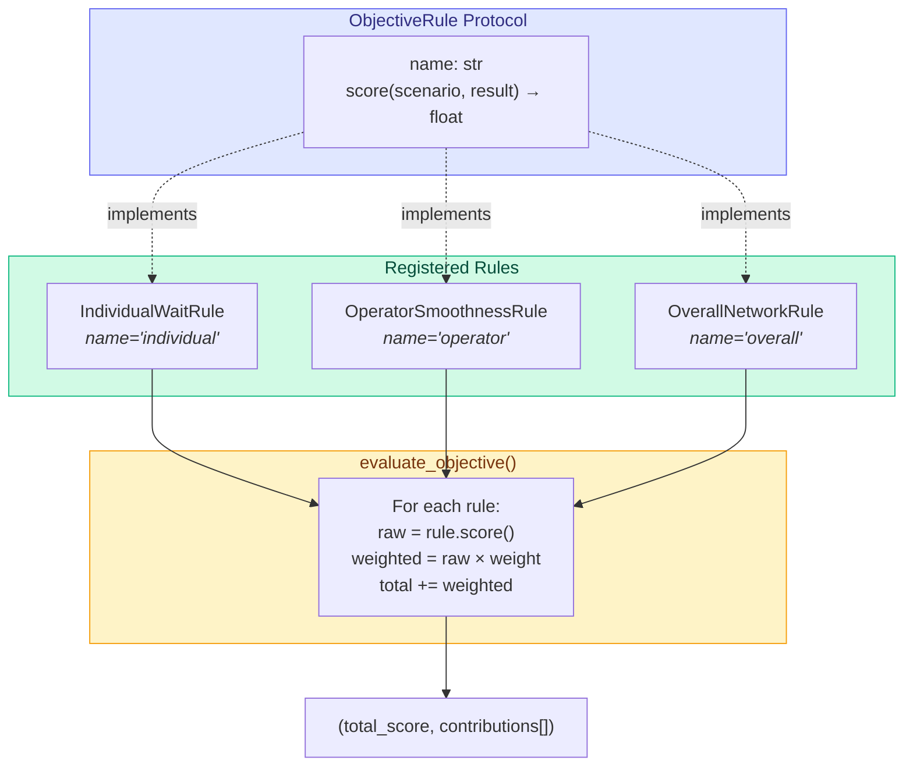

#### Rule Formulas

**IndividualWaitRule** (`name = "individual"`)
```
score = max(all_waits) + 0.12 × Σ(wait²) / N
```
Penalizes the worst bus wait + applies convex pressure to avoid hiding one very delayed bus inside a good average.

**OperatorSmoothnessRule** (`name = "operator"`)
```
per_operator = avg_wait + 0.5 × max_wait + 0.5 × stdev
score = mean(per_operator) + mean(|avg_i - network_avg|)
```
Penalizes within-operator variance + between-operator imbalance.

**OverallNetworkRule** (`name = "overall"`)
```
score = total_wait + 0.8 × total_charge_time + 0.05 × arrival_span
```
Penalizes aggregate wait, total charging time, and how long until the last bus arrives.

---

### 5. Scheduling Engine — `scheduler.py`

**Purpose:** The core 650-line engine that generates plans, simulates shared charger contention, and optimizes assignments.

#### Class Structure

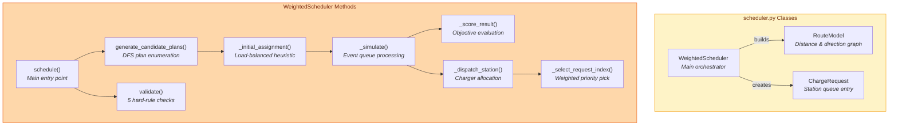

#### RouteModel API

| Method | What It Does |
|---|---|
| `distance(from, to)` | Absolute distance between any two nodes using cumulative positions |
| `travel_minutes(from, to)` | Ceiling of `distance / speed` in minutes |
| `direction(origin, dest)` | `+1` (forward) or `-1` (reverse) |
| `charging_stations_between(origin, dest)` | Ordered list of chargeable stations between two nodes |
| `leg_distances(origin, plan, dest)` | Distance of each leg: origin → plan[0] → plan[1] → ... → dest |

---

### 6. Streamlit Dashboard — `app.py`

**Purpose:** 313-line interactive web application that renders scheduling results.

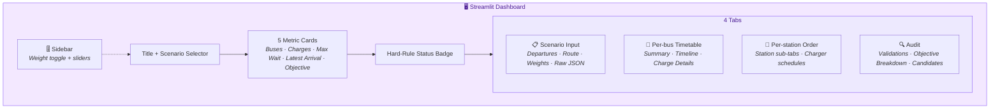

**Caching:** Both `scenario_index()` and `run_schedule()` use `@st.cache_data` — the schedule only re-runs when the scenario file or weight tuple changes.

**DataFrame helpers** (8 functions): Transform `Scenario` and `ScheduleResult` objects into clean `pd.DataFrame` tables for display.

---

## Scheduling Algorithm Deep-Dive

### Stage 1 — Candidate Plan Generation (DFS)

For each bus, enumerate all feasible subsets of charging stations along its route where every leg is within battery range:

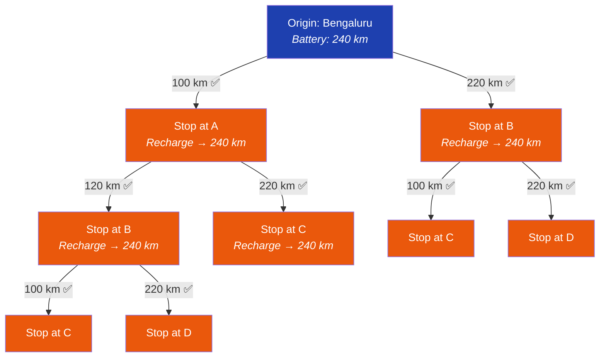

**Sort key priority:** `(# stops, short-leg penalty, -min_slack, station IDs)` — prefers fewer stops, balanced legs, and more battery margin.

**Cap:** Limited to `candidate_plan_limit` (default 24) plans per bus.

### Stage 2 — Initial Assignment

Greedy forward pass in departure order. For each bus, score every candidate plan by:

```
score = w_overall × charge_penalty
      + w_individual × (bucket_congestion + station_load)
      + w_operator × operator_bucket_congestion
```

Using 20-minute time buckets to spread demand temporally.

### Stage 3 — Event Simulation

Min-heap event queue with two event types:

| Event | Trigger | Action |
|---|---|---|
| `arrival` | Bus reaches a station or destination | If station: enqueue charge request. If destination: record arrival. |
| `charger_free` | A charger finishes a session | Re-dispatch the station queue. |

### Stage 4 — Weighted Dispatch

When a charger becomes free and buses are queued, `_select_request_index()` picks which bus charges next:

```
priority = w_overall × arrival_time
         - w_individual × (1.8 × current_wait + 0.6 × cumulative_wait)
         - w_operator × (operator_avg_wait + 4.0 × operator_queue_depth)
```

This creates a **weight-responsive dispatch**: high individual weight favors long-waiting buses; high operator weight favors operators with accumulated pressure; high overall weight favors FCFS throughput.

### Stage 5 — Local Search

```
For each pass in local_search_passes:
    Sort buses by total_wait (worst first)
    For each bus:
        Try every alternative candidate plan
        If any plan lowers the global objective → swap
    If no improvement in this pass → stop early
```

---

## Data Structure — Scenario JSON

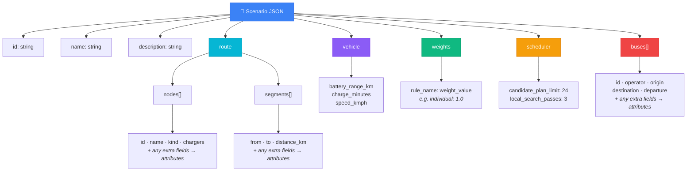

---

## Data Model Relationships

How entities connect at runtime:

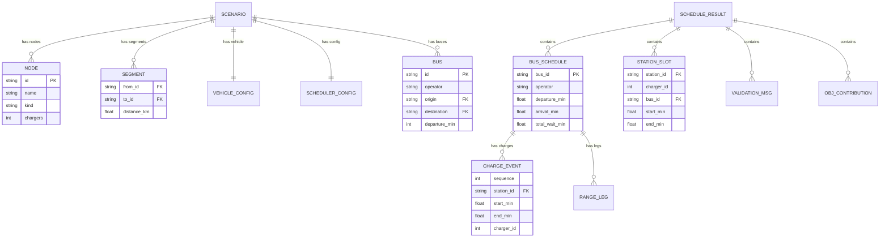

---

## Scoring System Internals

### Weight Flow Through the System

Weights from `scenario.weights` are used in **three** places — not just scoring:

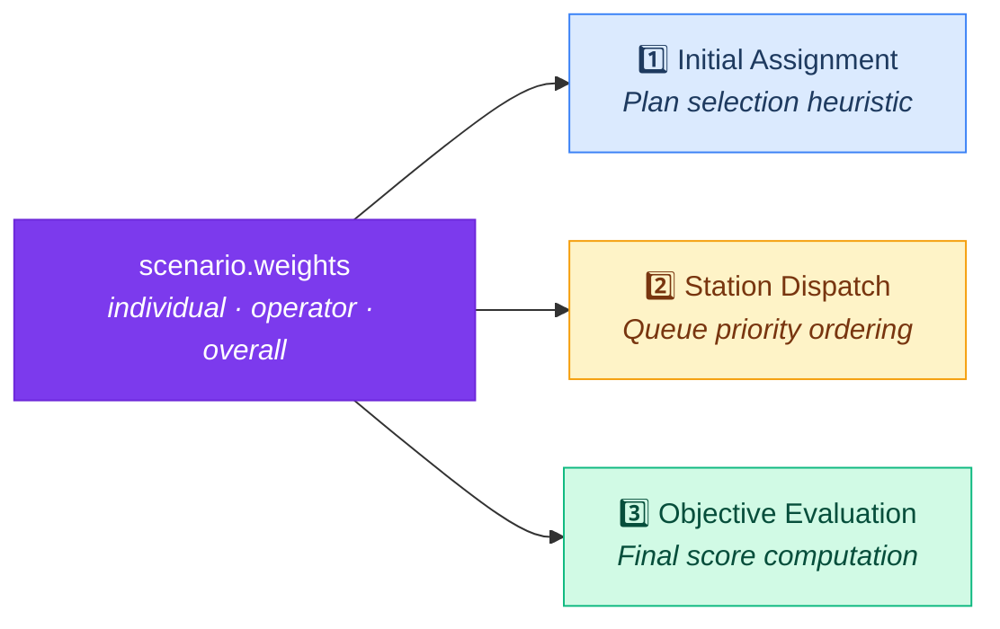

This means **changing a weight changes behavior at every level** — not just the final score. The dispatch order adapts, the initial assignment adapts, and the objective reflects the new emphasis.

---

## Hard-Rule Validation

5 post-schedule checks, each producing a `PASS` or `FAIL` with a detailed message:

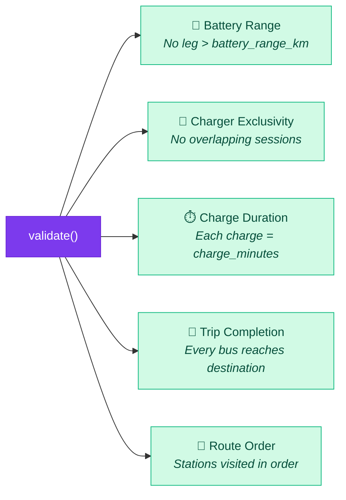

---

## Extensibility Design

### Adding a New Rule — Complete Flow

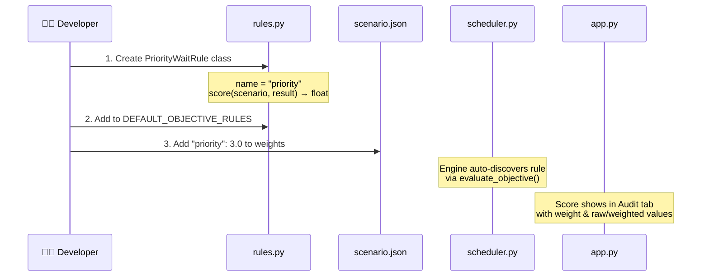

### Rule Protocol

Any object with `name: str` and `score(scenario, result) → float` qualifies:

```python
class ObjectiveRule(Protocol):
    name: str
    def score(self, scenario: Scenario, result: ScheduleResult) -> float: ...
```

---

## Data-Only Changes Matrix

Every change below requires **zero code modifications** — only scenario JSON edits:

| Change | Where to Edit | What the Engine Does |
|---|---|---|
| Add station E | `route.nodes` + `route.segments` | Candidate generation discovers it automatically |
| Remove station from scheduling | Set `"chargers": 0` | Station is skipped by candidate generator |
| Double chargers at B | `"chargers": 2` | Station calendar creates two charger lanes |
| Change segment distance | `route.segments` | Feasibility and travel time recompute |
| Change battery range | `vehicle.battery_range_km` | Candidate plans recompute with new range |
| Change charge duration | `vehicle.charge_minutes` | Simulation and validation use new duration |
| Change bus speed | `vehicle.speed_kmph` | Travel times recompute |
| Add / remove buses | `buses[]` | No fixed count in code |
| Add operator | New operator string | Operator scoring groups dynamically |
| Reverse / mix directions | Set origin & destination | Route order is inferred per bus |
| Add scenario weights | New weight key matching rule name | Missing weights default to 0.0 |
| Add extra bus metadata | Extra fields on bus object | Preserved in `bus.attributes` — accessible by custom rules |
| Add extra station metadata | Extra fields on node object | Preserved in `node.attributes` |

---

## Design Decisions & Tradeoffs

| Decision | Why |
|---|---|
| **DFS over ILP/LP** | Interpretable, fast for 20-bus scale, easy to debug. ILP would be overkill for this problem size. |
| **Frozen dataclasses** | Prevent accidental mutation during multi-pass scheduling. Immutability makes caching safe. |
| **Min-heap event sim** | Clean temporal ordering of arrivals and charger-free events. O(n log n) complexity. |
| **Weights in 3 places** | Assignment, dispatch, and scoring all respond to the same weights — one lever controls the full pipeline. |
| **Local search (not SA/GA)** | Deterministic, reproducible, and sufficient for the problem scale. No random restarts needed. |
| **JSON files (not DB)** | Self-contained scenarios. No server setup. Easy to version control and share. |
| **`attributes` dicts** | Forward-compatible: new fields in JSON survive parsing without schema changes. |
| **Protocol-based rules** | Structural typing via `Protocol` — no base class inheritance needed. Just match the interface. |

---

## Assumptions

| Assumption | Implication |
|---|---|
| All departures happen on the same service day | Arrivals may roll past midnight (shown as `+1d`) |
| Travel speed is constant per scenario | Configured in `vehicle.speed_kmph` |
| Charging always fills to full | Fixed duration, no partial charges |
| Endpoint slow chargers are outside scope | Terminals have `chargers: 0` |
| A bus only waits at stations where it charges | No pass-through delays |
| Route is modeled as a linear ordered path | Multiple independent routes sharing stations would be the next extension; the station calendar already keys resources by station ID |

---

<div align="center">

*For usage instructions, setup, and deployment — see [README.md](README.md)*

</div>
]]>
