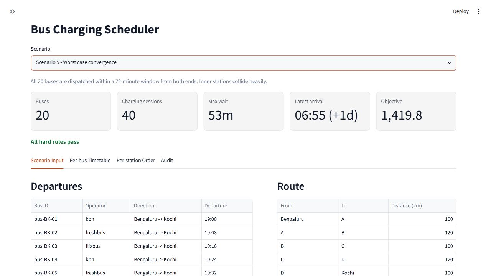
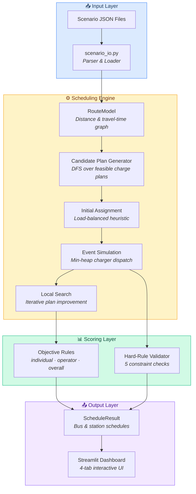
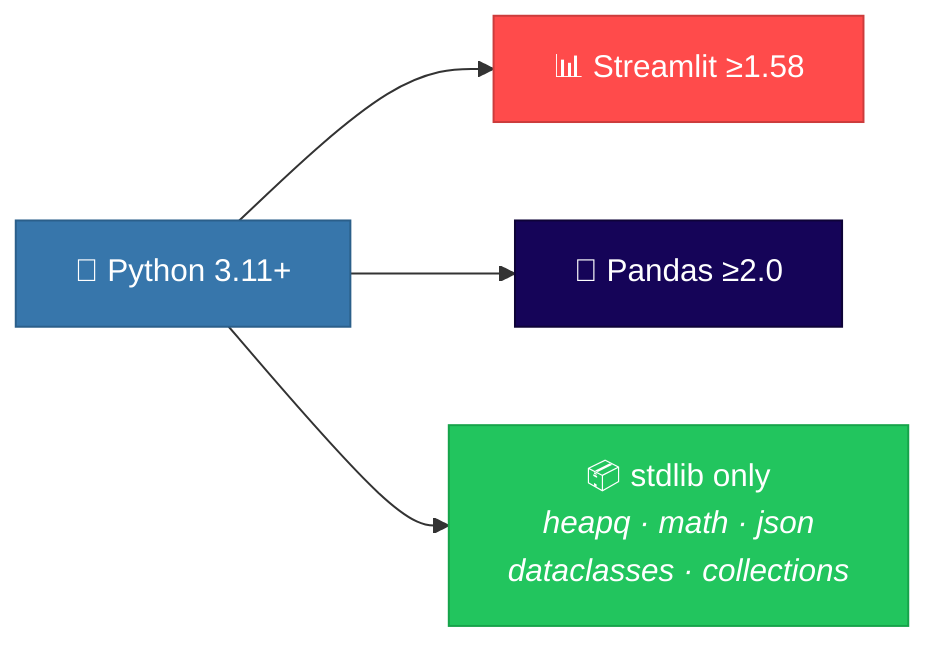
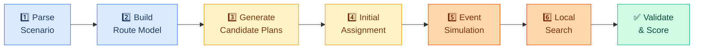
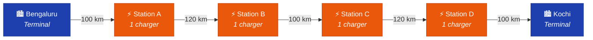
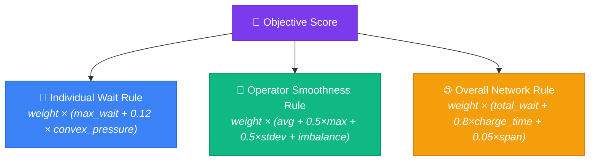

<div align="center">

# ⚡ Bus Charging Scheduler

### Intelligent Charging Orchestration for Electric Bus Fleets

[](https://python.org)
[](https://streamlit.io)
[](https://pandas.pydata.org)
[](LICENSE)

*A constraint-aware scheduling engine that assigns electric buses to shared en-route charging stations, balancing individual fairness, operator equity, and network-wide efficiency — all configurable through weighted soft rules.*

<br/>



</div>

---

## 📋 Table of Contents

- [Problem Statement](#-problem-statement)
- [Key Features](#-key-features)
- [Architecture at a Glance](#-architecture-at-a-glance)
- [Project Structure](#-project-structure)
- [Tech Stack](#-tech-stack)
- [Quick Start](#-quick-start)
- [How It Works](#-how-it-works)
- [Scenario Data Format](#-scenario-data-format)
- [Scoring & Objective Function](#-scoring--objective-function)
- [Hard Constraints](#-hard-constraints)
- [Interactive Dashboard](#-interactive-dashboard)
- [Extending the System](#-extending-the-system)
- [Testing](#-testing)
- [Deployment](#-deployment)

---

## 🎯 Problem Statement

Multiple electric bus operators share a linear route (e.g. **Bengaluru ↔ Kochi, 540 km**) with limited charging stations along the way. Each station has a fixed number of chargers, and buses from different operators travel in both directions with overlapping schedules.

**The challenge:** Assign each bus a charging plan — which stations to stop at and in what order — so that:

- ✅ No bus runs out of battery between stops
- ✅ No two buses use the same charger at the same time
- ✅ Wait times are minimized fairly across all buses and operators
- ✅ The overall network finishes as early as possible

---

## ✨ Key Features

| Feature | Description |
|---|---|
| 🔍 **Constraint-Aware Search** | Enumerates all feasible charging plans per bus via DFS, then optimizes assignments using local search |
| ⚖️ **Multi-Objective Scoring** | Three pluggable soft rules (individual, operator, overall) with configurable weights |
| 🏭 **Event-Driven Simulation** | Min-heap event queue simulates shared charger contention with weighted dispatch priority |
| 📊 **Interactive Dashboard** | Streamlit UI with scenario selector, weight sliders, per-bus timelines, and per-station schedules |
| 🧩 **Fully Data-Driven** | Add buses, stations, operators, or change routes — zero code changes required |
| 🔌 **Extensible Rule Engine** | Add a new scoring rule with one class + one JSON key — the engine auto-discovers it |
| ✅ **Hard-Rule Validation** | Post-schedule validation checks battery range, charger exclusivity, charge duration, trip completion, and route order |

---

## 🏗 Architecture at a Glance



> 📖 See [ARCHITECTURE.md](ARCHITECTURE.md) for a deep-dive into every component, data model, algorithm, and design decision.

---

## 📁 Project Structure

```
bus-charging-scheduler/
│
├── app.py                          # Streamlit dashboard entry point (313 lines)
├── requirements.txt                # Python dependencies
├── .gitignore                      # Git exclusions
│
├── bus_scheduler/                  # 🧠 Core scheduling engine package
│   ├── __init__.py                 #    Public API exports
│   ├── models.py                   #    Immutable dataclasses (11 models)
│   ├── scheduler.py                #    WeightedScheduler — plan gen, simulation, local search (650 lines)
│   ├── rules.py                    #    Pluggable objective rules + evaluator
│   ├── scenario_io.py              #    JSON parsing, loading, weight overrides
│   └── formatting.py               #    Clock & duration display utilities
│
├── data/
│   └── scenarios/                  # 📂 5 pre-built scenario JSON files
│       ├── scenario_1_even_spacing.json
│       ├── scenario_2_bunched_start.json
│       ├── scenario_3_asymmetric_load.json
│       ├── scenario_4_operator_heavy.json
│       └── scenario_5_worst_case_convergence.json
│
├── tests/
│   └── test_scheduler.py           # 🧪 Unit tests (3 test cases with sub-tests)
│
├── artifacts/
│   └── scheduler-app.png           # 📸 App screenshot
│
├── .streamlit/
│   └── config.toml                 # 🎨 Theme configuration (light, orange accent)
│
├── ARCHITECTURE.md                 # 📐 Detailed design & extension documentation
└── README.md                       # 📖 This file
```

---

## 🛠 Tech Stack



| Layer | Technology | Purpose |
|---|---|---|
| **Language** | Python 3.11+ | Type hints, dataclasses, structural pattern matching |
| **UI Framework** | Streamlit ≥1.58 | Interactive dashboard with tabs, metrics, dataframes, sidebars |
| **Data Processing** | Pandas ≥2.0 | DataFrame rendering for bus/station schedule tables |
| **Scheduling Core** | Python stdlib | `heapq` (event sim), `dataclasses` (models), `collections` (counters) |
| **Data Storage** | JSON files | Scenario definitions — no database required |
| **Testing** | `unittest` | Built-in test runner with subtests |

> **Zero external dependencies** beyond Streamlit and Pandas. The scheduling engine uses only Python standard library.

---

## 🚀 Quick Start

### Prerequisites

- Python 3.11 or higher
- pip package manager

### Installation & Run

```powershell
# 1. Clone the repository
git clone https://github.com/your-username/bus-charging-scheduler.git
cd bus-charging-scheduler

# 2. Create and activate virtual environment
python -m venv .venv
.\.venv\Scripts\Activate.ps1          # Windows PowerShell
# source .venv/bin/activate           # macOS / Linux

# 3. Install dependencies
pip install -r requirements.txt

# 4. Launch the dashboard
streamlit run app.py
```

The app opens at **http://localhost:8501** and auto-discovers all scenario files from `data/scenarios/`.

### Run Tests

```powershell
python -m unittest discover -s tests
```

---

## ⚙️ How It Works

The scheduling algorithm runs in **6 stages**, each cleanly separated:



| Stage | What Happens |
|---|---|
| **1. Parse Scenario** | Load JSON → build immutable `Scenario` with nodes, segments, buses, vehicle config, weights |
| **2. Build Route Model** | Compute cumulative distances, direction detection, travel-time calculations |
| **3. Generate Candidate Plans** | DFS over charging stations reachable within battery range; sort by leg-balance heuristic; cap at `candidate_plan_limit` |
| **4. Initial Assignment** | Greedily assign plans to buses considering station load, time-bucket congestion, and operator balance |
| **5. Event Simulation** | Min-heap event queue processes arrivals + charger-free events; weighted dispatch picks which waiting bus charges next |
| **6. Local Search** | Iterate over buses (worst-wait-first), try alternate plans, keep improvements; repeat for `local_search_passes` rounds |

---

## 📄 Scenario Data Format

Each scenario is a self-contained JSON file. Here's the structure:

```json
{
  "id": "scenario_1",
  "name": "Scenario 1 - Even spacing",
  "description": "Buses depart every 15 minutes...",
  "route": {
    "nodes": [
      {"id": "bengaluru", "name": "Bengaluru", "kind": "terminal", "chargers": 0},
      {"id": "A", "name": "A", "kind": "station", "chargers": 1},
      ...
    ],
    "segments": [
      {"from": "bengaluru", "to": "A", "distance_km": 100},
      ...
    ]
  },
  "vehicle": {
    "battery_range_km": 240,
    "charge_minutes": 25,
    "speed_kmph": 60
  },
  "weights": {"individual": 1.0, "operator": 1.0, "overall": 1.0},
  "scheduler": {"candidate_plan_limit": 24, "local_search_passes": 3},
  "buses": [
    {"id": "bus-BK-01", "operator": "kpn", "origin": "bengaluru", "destination": "kochi", "departure": "19:00"},
    ...
  ]
}
```

### Route Topology (Scenario 1)



> **Total route distance:** 540 km &nbsp;|&nbsp; **Battery range:** 240 km &nbsp;|&nbsp; **⇒ Each bus needs 2+ charging stops**

### Shipped Scenarios

| # | Scenario | Buses | Key Challenge |
|---|---|---|---|
| 1 | Even Spacing | 20 | Baseline — 15-min intervals, balanced directions |
| 2 | Bunched Start | 20 | 8-min intervals — heavy contention at inner stations |
| 3 | Asymmetric Load | 14 | Unbalanced direction split (10 vs 4) |
| 4 | Operator Heavy | 20 | High operator-fairness weight (2.0×) |
| 5 | Worst Case Convergence | 20 | All buses within 72-min window — maximum collision |

---

## 📊 Scoring & Objective Function

The objective function is a **weighted sum of three pluggable soft rules**:

```
Objective = Σ (weight_i × raw_score_i)
```



| Rule | Name Key | What It Penalizes |
|---|---|---|
| **Individual** | `individual` | Worst single-bus wait + convex pressure to avoid hiding outliers |
| **Operator** | `operator` | Within-operator spread + between-operator imbalance |
| **Overall** | `overall` | Total wait + total charging time + arrival time span |

> Weights are set per scenario in JSON and can be overridden live via the sidebar sliders.

---

## 🛡 Hard Constraints

After every schedule, 5 hard rules are validated:

| # | Rule | What It Checks |
|---|---|---|
| 1 | **Battery Range** | No leg between stops exceeds `battery_range_km` |
| 2 | **Charger Exclusivity** | No two sessions overlap on the same physical charger |
| 3 | **Charge Duration** | Every charge lasts exactly `charge_minutes` |
| 4 | **Trip Completion** | Every bus reaches its destination |
| 5 | **Route Order** | Station visits follow the linear route order |

---

## 🖥 Interactive Dashboard

The Streamlit dashboard has **4 tabs**:

| Tab | What It Shows |
|---|---|
| **Scenario Input** | Departure table, route segments, scenario weights, raw JSON |
| **Per-bus Timetable** | Bus summary (charging plan, wait times, arrival), full timeline, charge details |
| **Per-station Order** | Per-station charger schedule with arrival/start/end times and wait |
| **Audit** | Validation results (PASS/FAIL), objective score breakdown, candidate plans |

### Sidebar Controls

- **Scenario selector** — dropdown auto-populated from `data/scenarios/*.json`
- **Weight override toggle** — switch between scenario weights and live sliders
- **Weight sliders** — Individual, Operator, Overall (0.0 – 5.0, step 0.25)

---

## 🔌 Extending the System

### Add a New Scenario

Copy any file in `data/scenarios/`, change `id`, `name`, route data, weights, and `buses`. The app auto-discovers every `*.json` file.

### Add a New Scoring Rule

**1.** Create a class in `bus_scheduler/rules.py`:

```python
class PriorityWaitRule:
    name = "priority"

    def score(self, scenario, result):
        bus_meta = {bus["id"]: bus for bus in scenario.raw["buses"]}
        return sum(
            bus.total_wait_min
            for bus in result.bus_schedules.values()
            if bus_meta[bus.bus_id].get("priority") == "high"
        )
```

**2.** Register it in `DEFAULT_OBJECTIVE_RULES`:

```python
DEFAULT_OBJECTIVE_RULES = (
    IndividualWaitRule(),
    OperatorSmoothnessRule(),
    OverallNetworkRule(),
    PriorityWaitRule(),        # ← new
)
```

**3.** Add the weight to your scenario JSON:

```json
"weights": { "individual": 1.0, "operator": 1.0, "overall": 1.0, "priority": 3.0 }
```

### Data-Only Changes (Zero Code Edits)

| Change | How |
|---|---|
| Add/remove charging station | Edit `route.nodes` + `route.segments` |
| Change number of chargers | Edit `"chargers"` on a station node |
| Change battery range | Edit `vehicle.battery_range_km` |
| Change charge duration | Edit `vehicle.charge_minutes` |
| Change bus speed | Edit `vehicle.speed_kmph` |
| Add/remove buses | Edit `buses` array |
| Add a new operator | Use a new operator string — grouping is dynamic |
| Add custom bus metadata | Extra fields preserved in `bus.attributes` |

---

## 🧪 Testing

The test suite covers three critical dimensions:

| Test | What It Verifies |
|---|---|
| `test_all_shipped_scenarios_pass_hard_rules` | All 5 scenarios pass every hard constraint; all buses arrive; all plans have ≥2 charge stops |
| `test_weight_change_can_change_dispatch_order` | Changing operator weight produces a measurably different station schedule |
| `test_more_chargers_is_data_only` | Doubling chargers at station B works without code changes and utilizes charger #2 |

```powershell
# Run all tests
python -m unittest discover -s tests

# Run with verbose output
python -m unittest discover -s tests -v
```

---

## ☁️ Deployment

### Streamlit Community Cloud

1. Push this repo to GitHub
2. Create a [Streamlit Community Cloud](https://streamlit.io/cloud) app
3. Set entrypoint to `app.py`
4. Streamlit auto-installs from `requirements.txt`

### Local Docker (Optional)

```dockerfile
FROM python:3.11-slim
WORKDIR /app
COPY . .
RUN pip install -r requirements.txt
CMD ["streamlit", "run", "app.py", "--server.port=8501"]
```

---

<div align="center">

**Built with ❤️ using Python & Streamlit**

*A take-home assessment for electric bus fleet scheduling*

</div>

